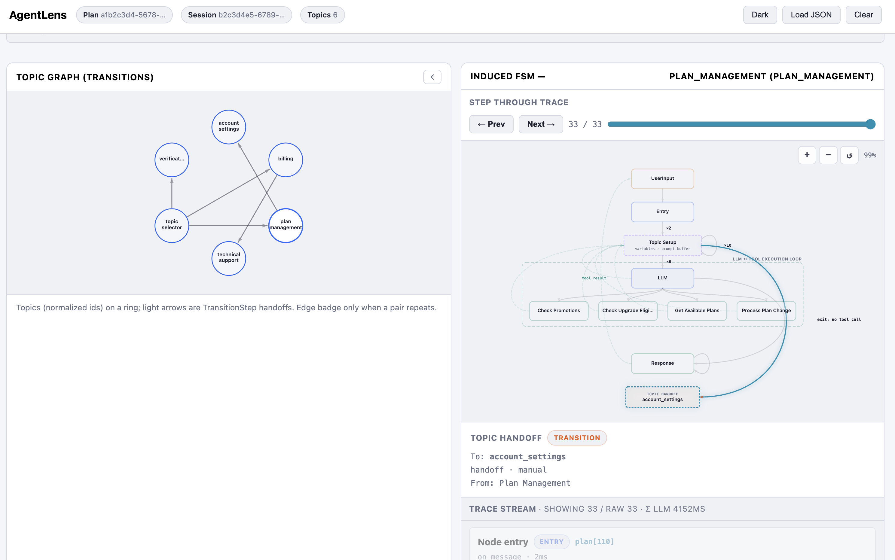

# AgentLens

A zero-dependency, single-file visualizer for **Agentforce** agent traces.

**Try it now:** <https://msrivastav13.github.io/AgentLens/>

Load a plan response from the **Agentforce DX** extension and instantly see:

- **Topic Graph** — directed graph of agent topic handoffs with transition counts
- **State Machine Playback** — step through each topic's orchestration and tool-execution flow with full LLM detail
- **Trace Stream** — filterable timeline of every plan step: LLM calls, tool executions, variable updates, reasoning iterations, and more
- **Graph Analysis** — degree distribution, SCC/WCC decomposition, betweenness centrality, diameter, and prose insights

## Quick Start

1. Open `index.html` in any browser (works with `file://`, no server required).
2. Click **Paste JSON** or **Upload** and provide the plan response JSON from the **Agentforce DX** extension.
3. Click a topic node to explore its state machine and trace timeline.

An example trace is included in `example/trace.json`.

## Features

| Feature | Details |
|---|---|
| Topic transitions | Ring layout with directed edges, multiplicity badges, self-loops |
| FSM playback | Prev/Next/scrub through trace events; active state highlights |
| Filters | Toggle variable updates, reasoning, node entry, enabled tools, `__` vars, `AgentScriptInternal_*` vars, full LLM bodies |
| LLM detail | System prompt, messages sent, model output, tool calls, latency |
| Function detail | Input/output JSON, execution latency |
| Graph metrics | \|V\|, \|E\|, density, SCC, WCC, diameter, betweenness centrality |
| Dark / Light mode | One-click theme toggle, preferences persist |

## Screenshot

## License

MIT
